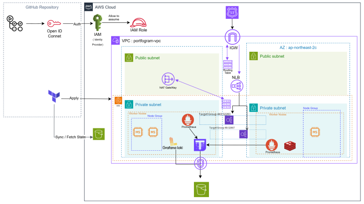

# Portfogram Terraform for EKS

## Overview
이 프로젝트는 AWS EKS(Elastic Kubernetes Service)를 Terraform을 사용하여 프로비저닝하고 관리하기 위한 Infrastructure as Code(IaC) 리포지토리입니다.

GitHub Actions를 활용한 CI/CD 파이프라인을 포함하고 있어, 자동화된 인프라 관리가 가능합니다.

## 인프라 아키텍처


## 프로젝트 구조
```
.
├── env
│   └── dev
├── modules
│   ├── compute
│   ├── security
│   ├── load_balancer
│   ├── storage
│   └── network
└── .github
    └── workflows
```

- `env/dev`: 개발 환경 설정
- `modules`: 재사용 가능한 Terraform 모듈
- `.github/workflows`: CI/CD 파이프라인 설정

## 주요 모듈

1. **network**: 네트워크 인프라 설정
    - [network 모듈 상세 정보](./modules/network/README.md)
2. **compute**: Kubernetes 클러스터 설정
    - [compute 모듈 상세 정보](./modules/compute/README.md)
3. **security**: 권한 및 역할 관리
    - [security 모듈 상세 정보](./modules/security/README.md)
4. **load_balancer**: 로드 밸런서 설정
    - [load_balancer 모듈 상세 정보](./modules/load_balancer/README.md)
5. **storage**: 객체 스토리지 설정
    - [storage 모듈 상세 정보](./modules/storage/README.md)

각 모듈의 자세한 사용법, 입력 변수, 출력 값에 대한 정보는 해당 모듈의 README 를 참조하세요.

## CI/CD 파이프라인

GitHub Actions를 활용하여 다음과 같은 자동화된 CI/CD 파이프라인을 구축했습니다:

**Pull Request 시:**
- `terraform fmt`를 사용하여 Terraform 코드 컨벤션 검증
- `terraform plan`을 실행하고 결과를 PR 코멘트로 추가

**Merge 시:**
- `terraform apply`를 자동으로 실행하여 AWS EKS 배포

보안을 위해 AWS IAM Role을 OIDC로 설정하여 GitHub Actions에서 AWS 리소스에 접근할 때 OIDC Token을 사용합니다.

## 시작하기

1. 필수 조건:
    - AWS CLI 설치 및 구성
    - Terraform 설치 (버전 1.0.0 이상)

2. 리포지토리 클론:
   ```
   git clone https://github.com/your-username/portfogram-terraform-for-EKS.git
   cd portfogram-terraform-for-EKS
   ```

3. 개발 환경 설정:
   ```
   cd env/dev
   ```

4. Terraform 초기화 및 적용:
   ```
   terraform init
   terraform plan
   terraform apply
   ```

---
### 관련된 기술 블로그 글
Terraform을 활용한 AWS EKS 클러스터 프로비저닝 대한 자세한 내용은 [개인 기술 블로그 글](https://medium.com/@minina1868/click-stop-code-yes-terraform을-이용해-인프라-구축하기-88c500b2109d)에서 확인할 수 있습니다.
